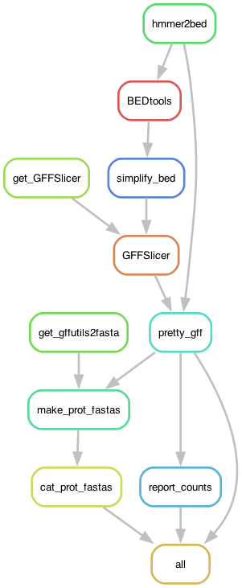

# FindSomAs: Find homologs of the *somA* locus in *Coprinopsis cinerea* and friends

The goal of this small [Snakemake](https://snakemake.readthedocs.io/en/stable/) pipeline is to find loci that are homologous to the *somA* locus in mushroom genomes. The pipeline can be run in a local laptop (designed on a MacOS within a MacBook Pro with an M4 chip but it probably works in Linux too).

The idea is simple: if we find genes annotated with a NACHT and Kinases close to those in the *somA* locus of *Coprinopsis cinerea*, then they are considered candidates. The concept of being closed is defined with a variable in the configuration file, but for the paper analyses we used 7000 bp as a threshold. That is, if the NACHT and Kinases genes are within 7 kb from each other, it's classified as a candidate.

The mine result of the pipeline is a count table of candidate loci per input genome, but it also produces additional files to inspect the loci in a genome browser like [IGV](https://igv.org/).

## Configuration file

The variables of the pipeline are controlled by the configuration file `config/config.yaml`, which looks like such:

```yaml
## ---- General parameters ----
# Variables
FLANKs: 7000

# Scripts
hmmer2bed: "workflow/scripts/hmmer2bed.py"

# HMMER output
path2hmmers: "data/HMMERresults"

## ---- Genbank annotation files ---- 
# Are the annotations produced with Augustus? True or False
Augustus: False

GenomesIDs: ["Psicy2", "LU_PSS_1.0", "Corgl3", "MGC_Penvy_1", "CC3", "Copmar1", "Copmic2", "Copph3", "Coprinellus_aureogranulatus_MPG-14n_reassembly", "Laccaria_amethystina_LaAM-08-1_v1.0", "ASM412641v1", "LU_COA_1.0", "Candolleomyces_eurysporus_reassembly_enz", "Candolleomyces_efflorescens_reassembly_enz", "V1.0", "Agabi_varbisH97_2"]

path2genomes: "path/to/assemblies/and/annotations/from/GenBank"
```

OR

```yaml
## ---- General parameters ----
# Variables
FLANKs: 7000

# Scripts
hmmer2bed: "workflow/scripts/hmmer2bed.py"

# HMMER output
path2hmmers: "data/HMMERresults"

## ---- Augustus annotation files ----
# Are the annotations produced with Augustus? True or False
Augustus: True

GenomesIDs: ["C_micaeus_DM1047", "C_micaeus_w1", "GCA_900156845.1_ASM90015684v1", "GCA_951394405.1_gfCopMica1.1"] 
```

You will have to run the pipeline twice to get the full set of samples used in the paper. See below.

## The data

For each sample with name `GenomeID` you need:

- The fasta file of the genome assembly named `GenomeID.fa` in the `data/Genomes` directory
- The genome annotation in GFF3 format named `GenomeID.gff` in the `data/Annotations` directory
- The HMMER results of the kinase genes in that genome names `kinase_hits_GenomeID.txt` in the `data\HMMERresults`. **These files are provided as such here in the repository.**
- The HMMER results of the NACHT genes in that genome names `nacht_hits_GenomeID.txt` in the `data\HMMERresults`. **These files are provided as such here in the repository.**

All genomes were obtained directly from GenBank. A list of NCBI accession numbers can be found in `data/GenBank_accessions.txt`. You'll need to download the genomes and their annotations (typically named `genomic.gff` by the GenBank system), place them and rename them as above in their corresponding directories.

Re-naming all these files once you download them from NCBI is a pain, so the pipeline can do it for you as long as the paths follow a specific format (see below).

In addition to these, some genomes without annotations available were annotated with the [Augustus](https://bioinf.uni-greifswald.de/augustus/) tool. The samples annotated this way are: "C_micaeus_DM1047", "C_micaeus_w1", "GCA_900156845.1_ASM90015684v1", and "GCA_951394405.1_gfCopMica1.1". The annotations for those genomes will be shared [SOMEWHERE, TODO](). 

### Preparing your files annotated with Augustus

Here just do it manually and put the assemblies following the format above, that is `data/Genomes/GenomeID.fa`:

	$ ls data/Genomes
	C_micaeus_DM1047.fa			C_micaeus_w1.fa				GCA_900156845.1_ASM90015684v1.fa	GCA_951394405.1_gfCopMica1.1.fa

### Preparing your files by downloading from NCBI

Put all your NCBI downloads in the same directory, and for each genome you must make a folder named `ACCESSIONNUMBER_GenomeID`. This is still annoying but slightly less work.

For example, say that you want to download the genome from the sample with the annoyingly long name `Laccaria_amethystina_LaAM-08-1_v1.0`. Then the data would look like so:

	$ ls GenBank/GCA_000827195.1_Laccaria_amethystina_LaAM-08-1_v1.0
	assembly_data_report.jsonl	data_summary.tsv		dataset_catalog.json		GCA_000827195.1

And within the folder `GCA_000827195.1`:

	$ ls GenBank/GCA_000827195.1_Laccaria_amethystina_LaAM-08-1_v1.0/GCA_000827195.1
	GCA_000827195.1_Laccaria_amethystina_LaAM-08-1_v1.0_genomic.fna	genomic.gff

Which correspond to the genome assembly `GCA_000827195.1_Laccaria_amethystina_LaAM-08-1_v1.0_genomic.fna` and the annotation `genomic.gff`.

Given that format, the pipeline will make symlinks of all data with the correct names for you. Notice that the NCBI accession number includes the version (the `.1` after `GCA_000827195` in this example).

## The code

The actual code is found in the `workflow` folder, which includes the pipeline itself (the `Snakefile` and the `rules`), plus the heart of the pipeline: an independent python script in `scripts/hmmer2bed.py`. The pipeline will also call two other scripts internally that are in my personal GitHub and remove them after it's done running.

## Building the environment

I built a [conda](https://docs.conda.io/en/latest/) environment using the [Mamba](https://mamba.readthedocs.io/en/latest/user_guide/mamba.html) implementation. Of course, you can install the software in many other ways, but this one is easy once you have mamba installed.

To create the environment do:

	$ mamba create -n copri -c bioconda gffutils=0.14 bedtools=2.31.1 snakemake-minimal=9.20.0 wget=1.21.4 conda-forge::sed

It will take a bit to resolve the environment. If it complains about conflicts, you might need to be mischievous and remove some restrictions first

	$ conda config --set channel_priority true

And re-run the `mamba` command above.

Once you are done with the pipeline, set your priority back to strict:

	$ conda config --set channel_priority strict

To activate the environment:

	$ mamba activate copri

## Running the pipeline

Go to working directory of this repository:

	$ cd path/to/2_FindSomAs

Activate the environment:

	$ mamba activate copri

### Workflow

You will run the pipeline twice: one for the Genbank-annotated assemblies, and another for the Augustus-annotated assemblies. To achieve this, you have to change the `config/config.yaml` file to put the parameters of one or the other. So the workflow is:

1) Make the configuration file for the Genbank annotation (i.e. comment the block of Augustus parameters)
2) Run the pipeline as explained below, that should produce the file `results/Loci_counts_GenBank.txt`
3) Make the configuration file for the Augustus annotation (i.e. comment the block of Genbank parameters)
4) Run the pipeline again in the same way, that should produce the file `results/Loci_counts_Augustus.txt`

And you are done!

### How to actually run the pipeline

To get an idea of how the pipeline looks like we can make a rulegraph:

	$ snakemake --rulegraph | dot -Tpng > rulegraph.png

(You might need to install `dot` by doing `brew install graphviz` first in a MacOS).



To check that the files for the pipeline are in order:

	$ snakemake -pn

Run it!

	$ snakemake --keep-going -j8

## Results

The pipeline will create a folder called `results`, which is already provided in the repository for your convenience. This folder contains 

```
results
├── beds
├── fastas
├── gffs
├── Loci_counts_Augustus.txt
└── Loci_counts_GenBank.txt
```

- `beds` -- a directory with the BED files with the locations of the candidate loci per genome
- `fastas` -- a directory with two multifasta files with protein sequences, one for the NACHT genes and another with the Kinase genes across all genomes.
- `gffs` -- a directory with the GFF3 files of just the candidate loci per genome, with colors for IGV
- `Loci_counts_Augustus.txt` -- Counts of candidate somA-like loci in the samples with Augustus annotation
- `Loci_counts_GenBank.txt` -- Counts of candidate somA-like loci in the samples with GenBank annotation

To put the tables together in a single file do:

	$ cat results/Loci_counts_GenBank.txt > results/Loci_counts.txt
	$ cat results/Loci_counts_Augustus.txt | grep -v 'Strain' >> results/Loci_counts.txt

Which you can open in Excel, or in R using the script in the folder `3_PlotSomACounts` in this repository.